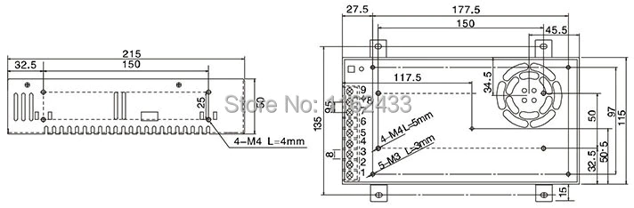

# S-360-xx power supply adapter

Add 4 10-A 2.5x5mm jack outputs, a 240V IEC connector and a 240V switch to S-360-5 and S-360-12 AC/DC power supplies.

## Documentation

The power supply drawing, found [here](https://fr.aliexpress.com/item/32713332357.html).

