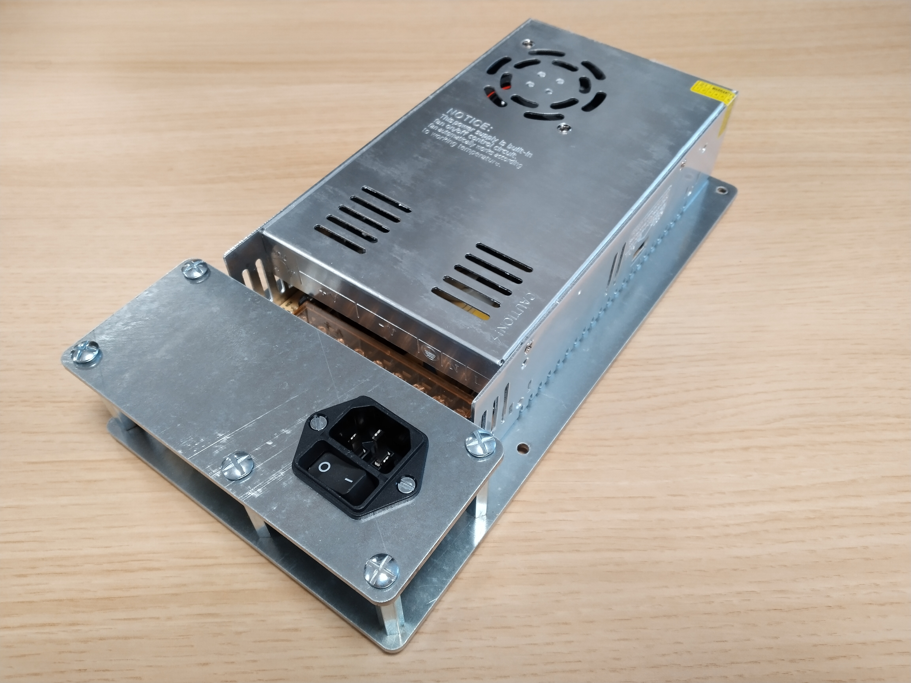
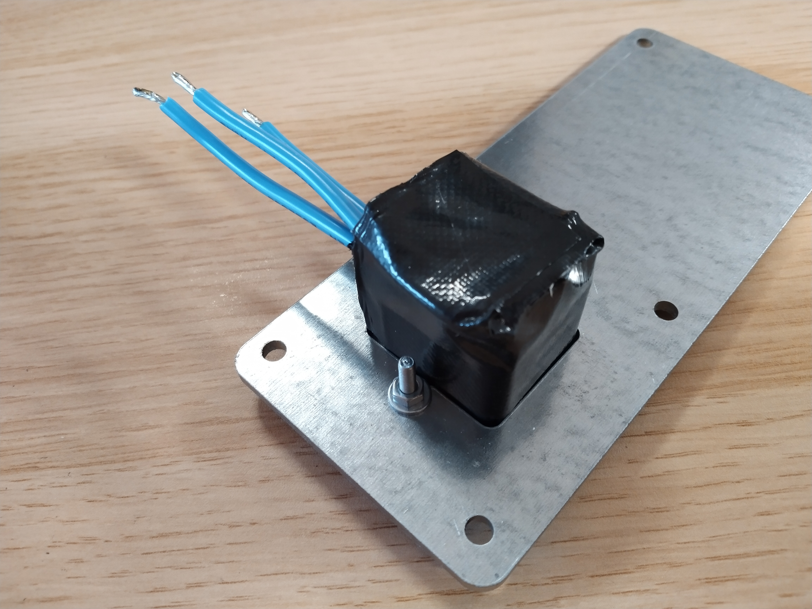
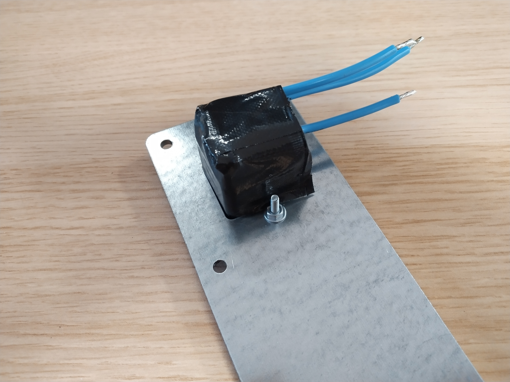
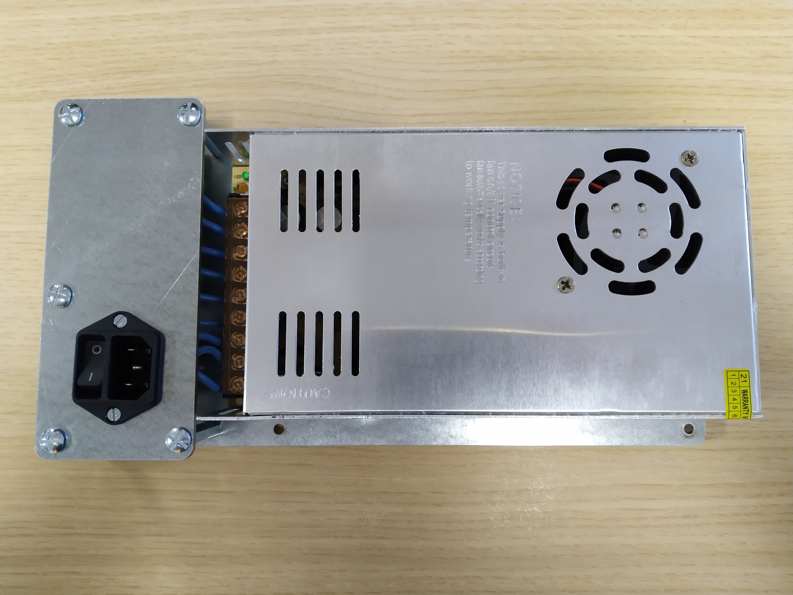

# S-360-xx power supply adapter

Add 4 10-A 2.5x5.5mm jack outputs and a 240V IEC connector with a switch to S-360-5 and S-360-12 AC/DC power supplies.

## Bill of materials

### Electronic parts

| Description | Reference | Amount |
| ----------- | --------- | ------ |
| IEC connector with integrated switch | DC11.0001.007 | 1 |
| 2.5X5.5mm power connector jack | PJ-082BH | 4 |

### Mechanical parts

| Description | Reference | Amount | Description |
| ----------- | --------- | ------ | ----------- |
| 40mm M4 steel hex standoff | 970400471 | 5 | Between upper plate and lower plate |
| 25mm M4 steel screw | - | 4 | Hold PCB |
| 10mm M4 steel screw | - | 14 | Fix upper plate to hex standoffs (5 screws), fix lower plate to hex standoffs (5 screws), fix power supply to lower plate (4 screws) |
| 16mm M3 steel screw | - | 4 | Fix IEC connector to upper plate |
| M4 steel nut | - | 12 | Hold PCB |
| M3 steel nut | - | 2 | Fix IEC connector to upper plate |
| 10mm M4 steel washer | - | 30 | Lock upper plate to hex standoffs (5 washers), lock lower plate to hex standoffs (5 washers), lock power supply to lower plate (4 washers), 4 per PCB screw (16 washers) |
| M3 steel washer | - | 2 | Lock IEC connector to upper plate |

## Documentation

The power supply drawing, found [here](https://fr.aliexpress.com/item/32713332357.html).

## Photo gallery

### PCB

### Casing plates

### Assembly

### Powering a test bench at BayLibre

